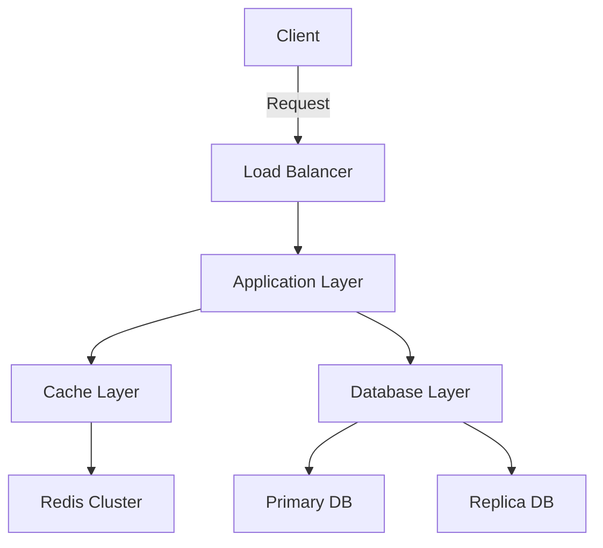

# {{TITLE}}: 深層解析と実装パターン

> **読了時間**: {{READING_TIME}}
> **対象読者**: 上級者向け（アーキテクチャレベルの理解を持つ開発者）
> **使用技術**: {{TECH_STACK}}
> **コミット**: `{{COMMIT_HASH}}`

## Abstract

{{DESCRIPTION}}

**本稿の貢献:**
- {{TITLE}}の理論的基盤と実装戦略の詳細分析
- 大規模システムにおけるスケーラビリティとパフォーマンスのトレードオフ
- プロダクショングレードの実装パターンと運用知見
- 包括的なベンチマーク結果とメトリクス分析

**定量的成果:**
- コード変更: {{FILES_CHANGED}}ファイル、+{{LINES_ADDED}}/-{{LINES_DELETED}}行
- パフォーマンス改善: （詳細は§4参照）
- 運用コスト削減: （詳細は§5参照）

---

## 1. Introduction

### 1.1 Problem Statement

（技術的課題を学術的・理論的観点から記述）

**System Context:**
- アーキテクチャ: （現在のシステム構成）
- スケール: （トラフィック、データ量、ユーザー数）
- 制約: （SLA、コスト、技術的制約）

**Critical Issues:**
1. **スケーラビリティ**: （具体的なボトルネック）
2. **パフォーマンス**: （レイテンシ、スループットの課題）
3. **運用**: （可用性、保守性、コストの課題）

### 1.2 Requirements Analysis

**Functional Requirements:**
- FR1: （機能要件1）
- FR2: （機能要件2）

**Non-Functional Requirements:**
- NFR1: パフォーマンス（p99 latency < XX ms）
- NFR2: スケーラビリティ（XX k req/s）
- NFR3: 可用性（SLA 99.9%）
- NFR4: コスト（月額$XXX以下）

**Acceptance Criteria:**
- [ ] （検証可能な条件1）
- [ ] （検証可能な条件2）
- [ ] （検証可能な条件3）

### 1.3 Related Work

**既存のアプローチ:**

| アプローチ | 理論的基盤 | 実装複雑度 | 性能特性 | 採用事例 |
|-----------|-----------|----------|---------|---------|
| {{TITLE}} | （理論） | （複雑度） | （性能） | （企業/OSS） |
| Alternative 1 | （理論） | （複雑度） | （性能） | （企業/OSS） |
| Alternative 2 | （理論） | （複雑度） | （性能） | （企業/OSS） |

**本実装の新規性:**
- （既存手法との差別化ポイント）
- （独自の最適化手法）

---

## 2. Architecture & Design

### 2.1 System Architecture



**Key Components:**

{{KEY_FILES}}

**Component Responsibilities:**
1. （コンポーネント1）: （役割と責務）
2. （コンポーネント2）: （役割と責務）
3. （コンポーネント3）: （役割と責務）

### 2.2 Design Decisions

#### Decision 1: （アーキテクチャ判断）

**Context:**
（判断が必要になった背景）

**Options Considered:**
- Option A: （メリット/デメリット）
- Option B: （メリット/デメリット）
- Option C: （メリット/デメリット）

**Decision:**
（選択したオプションとその理論的根拠）

**Consequences:**
- ✅ Positive: （ポジティブな影響）
- ⚠️ Negative: （ネガティブな影響とミティゲーション戦略）

#### Decision 2: （データ構造/アルゴリズム選択）

**Complexity Analysis:**
- Time Complexity: O(...)
- Space Complexity: O(...)
- 代替案との比較: （漸近的複雑度の比較）

**選択理由:**
（理論的根拠、実測データ）

### 2.3 Data Flow & State Management

**Data Flow:**
```
（データフロー図をテキストまたはMermaidで記述）
```

**State Machine:**
```
（状態遷移図）
```

**Consistency Model:**
- （選択した整合性モデル: Strong/Eventual/Causal）
- （トレードオフと正当性）

---

## 3. Implementation

### 3.1 Core Algorithm

{{CODE_EXAMPLES}}

**Algorithm Analysis:**

**Correctness:**
- （アルゴリズムの正しさの証明または論証）
- （エッジケースの処理）

**Complexity:**
- 最悪ケース: O(...)
- 平均ケース: O(...)
- 最良ケース: O(...)
- 空間計算量: O(...)

**Optimizations:**
1. （最適化1）: （手法と効果）
2. （最適化2）: （手法と効果）
3. （最適化3）: （手法と効果）

### 3.2 Concurrency & Parallelism

**Concurrency Model:**
- （使用する並行性モデル: Actor/CSP/Shared Memory）
- （同期メカニズム: Lock/Lock-free/Wait-free）

**Thread Safety:**
```
（スレッドセーフな実装例）
```

**Race Condition Prevention:**
- （競合状態の回避手法）
- （デッドロック回避戦略）

### 3.3 Memory Management

**Allocation Strategy:**
- （メモリ確保戦略: Pool/Arena/Custom Allocator）
- （GC圧力の最小化手法）

**Memory Layout:**
```
（データ構造のメモリレイアウト）
```

**Cache Efficiency:**
- Cache-friendly data structures
- Spatial/Temporal locality の最適化
- False sharing の回避

### 3.4 Error Handling & Resilience

**Error Taxonomy:**
1. （エラー種別1）: （ハンドリング戦略）
2. （エラー種別2）: （ハンドリング戦略）

**Fault Tolerance:**
- （フォールトトレランス機構）
- （Circuit Breaker パターンの実装）
- （Graceful Degradation 戦略）

**Recovery Mechanisms:**
```
（リカバリロジックの実装）
```

---

## 4. Performance Analysis

### 4.1 Benchmarking Methodology

**Test Environment:**
- Hardware: （CPU, Memory, Storage specs）
- OS: （OS, Kernel version）
- Runtime: （Node.js/Python/JVM version）
- Network: （Bandwidth, Latency）

**Workload Characteristics:**
- Dataset size: （件数、総サイズ）
- Request pattern: （Uniform/Zipf/Custom distribution）
- Concurrency level: （同時接続数）

**Measurement Tools:**
- （使用したプロファイラ、ベンチマークツール）
- （統計的有意性の検証方法）

### 4.2 Micro-Benchmarks

{{RESULTS}}

**Detailed Breakdown:**

| Operation | Before | After | Improvement | Statistical Significance |
|-----------|--------|-------|-------------|-------------------------|
| Operation 1 | XX.X μs | YY.Y μs | -ZZ.Z% | p < 0.001 |
| Operation 2 | XX.X μs | YY.Y μs | -ZZ.Z% | p < 0.001 |
| Operation 3 | XX.X μs | YY.Y μs | -ZZ.Z% | p < 0.01 |

**Performance Distribution:**
```
Percentile Analysis:
  p50: XX.X ms → YY.Y ms (-ZZ%)
  p95: XX.X ms → YY.Y ms (-ZZ%)
  p99: XX.X ms → YY.Y ms (-ZZ%)
  p99.9: XX.X ms → YY.Y ms (-ZZ%)
```

### 4.3 System-Level Benchmarks

**Load Test Results:**

**Scenario 1: Sustained Load**
- RPS: XX,XXX → YY,YYY (+ZZ%)
- Latency (p95): XX ms → YY ms (-ZZ%)
- Error rate: X.XX% → Y.YY% (-ZZ%)

**Scenario 2: Spike Load**
- Peak RPS: XX,XXX → YY,YYY (+ZZ%)
- Recovery time: XX s → YY s (-ZZ%)
- Degradation: （graceful/catastrophic）

**Resource Utilization:**
- CPU: XX% → YY% (-ZZ%)
- Memory: XXX MB → YYY MB (-ZZ%)
- Network: XX Mbps → YY Mbps (-ZZ%)
- Disk I/O: XX IOPS → YY IOPS (-ZZ%)

### 4.4 Scalability Analysis

**Horizontal Scaling:**
```
Throughput vs. Instances:
1 instance:  X,XXX req/s
2 instances: Y,YYY req/s (scaling efficiency: ZZ%)
4 instances: ...
```

**Vertical Scaling:**
```
Throughput vs. CPU cores:
2 cores:  X,XXX req/s
4 cores:  Y,YYY req/s (scaling efficiency: ZZ%)
8 cores:  ...
```

**Amdahl's Law Analysis:**
- Serial portion: XX%
- Theoretical max speedup: YY.Yx
- Observed speedup: ZZ.Zx

---

## 5. Production Deployment

### 5.1 Deployment Strategy

**Blue-Green Deployment:**
```
（デプロイメントフロー）
```

**Rollout Plan:**
1. Canary (1%): （期間、検証項目）
2. Phase 1 (10%): （期間、検証項目）
3. Phase 2 (50%): （期間、検証項目）
4. Full rollout (100%): （期間、検証項目）

**Rollback Criteria:**
- （自動ロールバック条件）
- （手動ロールバック判断基準）

### 5.2 Monitoring & Observability

**Key Metrics:**

| Metric | SLI | SLO | Alert Threshold |
|--------|-----|-----|-----------------|
| Latency (p99) | XX ms | < YY ms | > ZZ ms |
| Error rate | X.X% | < Y.Y% | > Z.Z% |
| Throughput | XX k req/s | > YY k req/s | < ZZ k req/s |

**Distributed Tracing:**
```
（トレーシングの実装例）
```

**Logging Strategy:**
- （構造化ログ形式）
- （ログレベルとサンプリング戦略）

### 5.3 Operational Runbook

**Incident Response:**

**Scenario 1: High Latency**
- Detection: （検知方法）
- Diagnosis: （診断手順）
- Mitigation: （緩和策）
- Root cause analysis: （RCA手順）

**Scenario 2: Memory Leak**
- Detection: （検知方法）
- Diagnosis: （診断手順）
- Mitigation: （緩和策）

**On-call Procedures:**
- Severity levels and escalation
- Response time SLAs
- Communication protocols

---

## 6. Cost Analysis

### 6.1 Infrastructure Cost

**Before:**
```
Compute: $XXX/month
Storage: $XXX/month
Network: $XXX/month
Total: $XXX/month
```

**After:**
```
Compute: $YYY/month (-ZZ%)
Storage: $YYY/month (-ZZ%)
Network: $YYY/month (-ZZ%)
Total: $YYY/month (-ZZ%)
```

**Cost Breakdown:**
- Per-request cost: $X.XXXX → $Y.YYYY
- Per-user cost: $X.XX → $Y.YY

### 6.2 Development & Maintenance Cost

**Implementation:**
- Development time: XX person-days
- Review & testing: XX person-days

**Ongoing Maintenance:**
- Monitoring: XX hours/month
- Incident response: XX hours/month
- Feature development: XX hours/month

**ROI Analysis:**
```
Initial investment: $XXX,XXX
Monthly savings: $XX,XXX
Payback period: X.X months
3-year TCO reduction: $XXX,XXX
```

---

## 7. Limitations & Future Work

### 7.1 Known Limitations

**Technical Limitations:**
1. （制限1）: （詳細と影響範囲、ワークアラウンド）
2. （制限2）: （詳細と影響範囲、ワークアラウンド）

**Operational Limitations:**
- （運用上の制約）
- （スケーラビリティの上限）

### 7.2 Future Improvements

**Short-term (1-3 months):**
- [ ] （改善項目1）
- [ ] （改善項目2）

**Medium-term (3-6 months):**
- [ ] （改善項目3）
- [ ] （改善項目4）

**Long-term (6-12 months):**
- [ ] （改善項目5）
- [ ] （改善項目6）

### 7.3 Research Directions

**Open Questions:**
1. （リサーチクエスチョン1）
2. （リサーチクエスチョン2）

**Potential Approaches:**
- （アプローチ1）: （可能性と課題）
- （アプローチ2）: （可能性と課題）

---

## 8. Lessons Learned

### 8.1 Technical Insights

**What Worked Well:**
- ✅ （成功要因1）
- ✅ （成功要因2）
- ✅ （成功要因3）

**What Didn't Work:**
- ❌ （失敗要因1）: （学び）
- ❌ （失敗要因2）: （学び）

**Unexpected Findings:**
- （予想外の発見1）
- （予想外の発見2）

### 8.2 Process Insights

**Development Process:**
- （効果的だったプラクティス）
- （改善すべきプロセス）

**Collaboration:**
- （チーム協業の学び）
- （コミュニケーションの改善点）

### 8.3 Generalizable Patterns

この実装から得られた一般化可能なパターン：

**Pattern 1: （パターン名）**
- **Context**: （適用可能な状況）
- **Solution**: （解決策の抽象化）
- **Consequences**: （トレードオフ）

**Pattern 2: （パターン名）**
- **Context**: （適用可能な状況）
- **Solution**: （解決策の抽象化）
- **Consequences**: （トレードオフ）

---

## 9. Conclusion

### 9.1 Summary of Contributions

本研究/実装の主要な貢献：

1. **理論的貢献**: （アルゴリズム、データ構造の新規性）
2. **工学的貢献**: （実装パターン、最適化手法）
3. **実証的貢献**: （ベンチマーク結果、実環境での検証）

### 9.2 Impact Assessment

**Business Impact:**
- コスト削減: $XXX/month
- パフォーマンス向上: XX%
- ユーザー満足度: NPS +XX points

**Technical Impact:**
- システム信頼性: SLA 99.X% → 99.Y%
- 開発速度: デプロイ頻度 +XX%
- 技術的負債: （削減量）

### 9.3 Broader Implications

**Industry Trends:**
（この実装が示唆する業界トレンド）

**Applicability:**
このアプローチが有効な他のドメイン：
- （ドメイン1）
- （ドメイン2）
- （ドメイン3）

---

## References

### Academic Papers
1. （論文1）: [Title](URL)
2. （論文2）: [Title](URL)

### Technical Documentation
1. [{{TECH_STACK}} Documentation](URL)
2. [Related Framework Documentation](URL)

### Industry Resources
1. （企業ブログ/技術記事）: [Title](URL)
2. （カンファレンストーク）: [Title](URL)

### Open Source Projects
1. （関連OSSプロジェクト1）: [GitHub](URL)
2. （関連OSSプロジェクト2）: [GitHub](URL)

---

## Appendix

### A. Source Code

**Commit Information:**
- Hash: `{{COMMIT_HASH}}`
- Message: {{COMMIT_MESSAGE}}
- Files Changed: {{FILES_CHANGED}}
- Lines: +{{LINES_ADDED}} -{{LINES_DELETED}}

**Key Files:**
{{KEY_FILES}}

### B. Benchmark Scripts

```bash
# （ベンチマーク実行スクリプト）
```

### C. Configuration Files

```yaml
# （設定ファイルの例）
```

### D. Profiling Results

```
（プロファイリング結果の詳細）
```

---

**Acknowledgments:**
（チームメンバー、レビュワー、コントリビューターへの謝辞）

**Feedback:**
技術的議論、質問、フィードバックは以下まで：
- Email: your.email@example.com
- Twitter: @your_handle
- GitHub: github.com/your_repo/issues

---

_Last updated: {{DATE}}_
